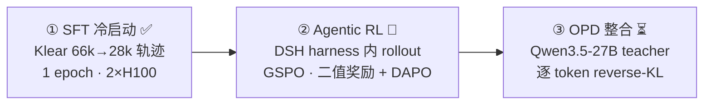
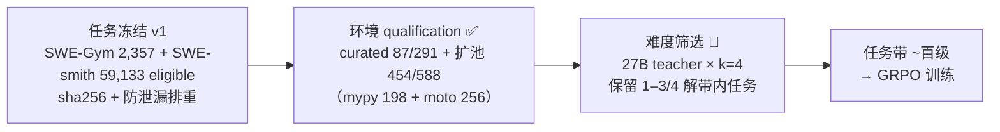

# Code-Agent-RL：小预算三段式训练 Coding Agent

[](LICENSE)
[](https://github.com/python/cpython)
[](https://github.com/pytorch/pytorch)
[](https://github.com/THUDM/slime)
[](https://github.com/NVIDIA/Megatron-LM)
[](https://github.com/sgl-project/sglang)
[](https://github.com/vllm-project/vllm)
[](https://github.com/deepseek-ai/deepseek-harness)

> Qwen3.5-9B × DeepSeek Harness（DSH）× GRPO + On-Policy Distillation，
> 在 2–4 张 H100 上完整复现工业级 coding-agent 训练管线。
>
> English: a full three-stage coding-agent post-training pipeline
> (SFT → agentic GRPO → on-policy distillation) for Qwen3.5-9B with the
> DeepSeek Harness, engineered to fit a 2–4×H100 budget.

**状态**：阶段① SFT 已完成并通过验收；阶段② 奖励栈四模块落地（11/11 单测）、任务池
qualification+扩池完成（87+454）、27B 难度筛选批进行中；阶段③ OPD 配置就绪。
进度看 [PROGRESS.md](PROGRESS.md)，决策叙事看 [docs/decision-log.md](docs/decision-log.md)，
完整调研看 [docs/research-log.md](docs/research-log.md)。

## 这是什么

从基座到 agent 的完整训练管线，对标 DeepSeek-V4 技术报告（arXiv 2606.19348）的
「专家 GRPO + OPD 整合」设计的小预算复现：



任务侧的漏斗（阶段② 现在进行到的位置）：



三个差异化点（开源 landscape 中无人同时做过）：
1. **DeepSeek Harness 作为训练/部署 harness**——「harness 即训练环境」
   （Polar，arXiv 2605.24220，NVIDIA 的结论）的实践；
2. **小预算 OPD**——8B 级模型上 OPD 优于纯 GRPO 的样本效率
   （SOD，arXiv 2605.07725）；
3. **全部评估可复现**——冻结评估集 + 逐 token 交叉验证 + 金标对照，
   证据链全部入库 [reports/](reports/)。

## 当前结果（阶段① 验收，2026-09-12）

**HumanEvalPlus（P1 协议，前 32 题，greedy）**——护栏：SFT 不损伤底座能力

| 模型 | 通过 | 失败题 |
|---|---|---|
| Qwen3.5-9B base | 31/32（96.9%） | HumanEval/10 |
| **SFT 后** | **31/32（96.88%）** | HumanEval/10（同一题） |

**Held-out 轨迹 NLL**（assistant-token 掩码，800 行，与训练目标同款 loss mask）——格式习得

| 切片 | base | SFT | Δ |
|---|---|---|---|
| 同格式 held-out（未训过） | 0.275 | **0.185** | **−33%** |
| 训练集参照 | 0.286 | 0.117 | −59% |
| 跨格式 OpenHands / R2E | 0.672 / 0.439 | 0.631 / 0.431 | −6% / −2% |

> 数字可信度：vLLM prompt_logprobs 结果与 HF transformers 前向（训练栈同款）逐行对拍，
> max|diff| < 6e-4。

**零样本 SWE 轨迹 A/B**（20 个 held-out SWE-Gym 任务，同预算，本地判分协议）——SFT 价值判定

| 指标 | base | **SFT** |
|---|---|---|
| 解决率 | 3/20（15%） | **6/20（30%）** |
| 规范提交率 | 10% | **100%** |
| 格式错误 | 18 次 | **3 次** |
| 平均步数 | 33.3 | **18.8** |

证据与逐题明细：[reports/stage1-sft-eval-20260912.md](reports/stage1-sft-eval-20260912.md)、
[reports/sft-ab-20260912.md](reports/sft-ab-20260912.md)。

## 工程要点（不是调包，是接线）

- **训练栈**：THUDM/slime（钉 commit `4c193f1f`，工作树零修改）+ Megatron-LM +
  SGLang；环境按官方 `build_conda.sh` 收敛（torch 2.11+cu129 / TE 2.16.1 /
  flash-attn 2.8.3）。
- **DSH 接入**：`slime_dsh/` 薄适配层——`BaseHarness` 生命周期（`--dsh-check` 通过）
  + **LocalProcessSandbox**（slime Sandbox 协议的本地后端：每任务工作区、进程组隔离、
  并发 marker 防串扰，9/9 验收）+ 冻结判分器作为 RL 奖励（金标=1.0 / 空 patch=0.0
  集成测试通过）+ **奖励栈四模块**（二值核 / GLM-5 组修复+组归一化 / 格式罚字节级
  token 定位 / 防作弊拦截，11/11 单测，系数默认零/关走环境变量）。
- **2×H100 训练显存术**：TP2 + 优化器 CPU 卸载 + 精度感知优化器 + 全重计算；
  RL 阶段 4 卡解耦布局（TP2 训练 + TP2 rollout）。
- **数据纪律**：训练/评估互斥的排除审计（SWE-bench Verified 500 / held-out /
  历史任务全量核对），RL 任务清单确定性冻结（sha256 入库）。
- **评估纪律**：官方协议优先（evalplus CLI / 官方 harness）；本地协议行明确标注，
  绝不冒充官方成绩。

## 目录导览

```
slime_dsh/            DSH→slime 适配层（harness + 本地 sandbox + RL 奖励后端）
scripts/              全流程脚本（SFT/RL/OPD 训练入口、评估、任务准备、检查）
configs/              训练配置、任务冻结清单、GPU 分配记录
reports/              验收结果 + 证据（表格与逐行数据）
research/             论文/项目调研快照（带 sha256 的 manifest）
docs/research-log.md  完整调研与决策日志（1230 行，项目的大脑）
PROGRESS.md           进度单一入口
```

## 复现入口（示意）

```bash
source scripts/env.sh
bash scripts/slime_rl.sh --check          # 上游 CPU 测试
bash scripts/slime_rl.sh --dsh-check      # DSH 生命周期检查
.venv-train-rl/bin/python scripts/check_local_sandbox.py   # 本地沙箱（9 tests）
.venv-train-rl/bin/python scripts/check_reward_stack.py    # 奖励栈（11 tests）
bash scripts/train_sft_coldstart.sh       # SFT 配置（print-only，--launch 受权限保护）
bash scripts/train_agent_rl.sh            # GRPO 配置（print-only，超参需人工批准）
```

> 权重/数据/缓存不入库（体积与许可）；环境为项目内 venv + 钉版本 wheels。

## 引用（方法源头）

- On-Policy Distillation：Thinking Machines 博客；SOD（arXiv 2605.07725）
- GRPO：DeepSeekMath（arXiv 2402.03300）、DeepSeek-R1（arXiv 2501.12948）
- Harness 即训练环境：Polar（arXiv 2605.24220，NVIDIA）
- 同族工业设计：DeepSeek-V4 TR（arXiv 2606.19348）、GLM-5 TR（arXiv 2602.15763）
- 完整文献地图见 [docs/research-log.md](docs/research-log.md)

## 署名

- **方案构思**：[Claude Code](https://claude.com/product/claude-code)（Anthropic）
- **工程实现**：ZCode（GLM，智谱）——全部代码、调研、训练与评测执行
